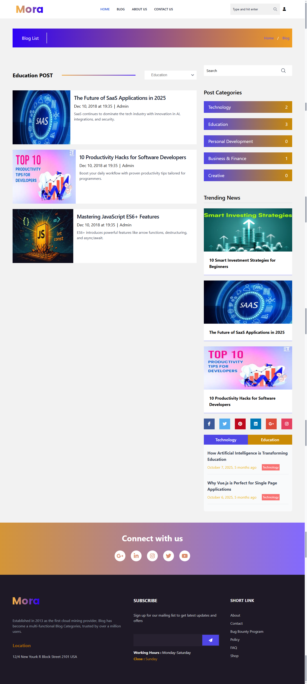
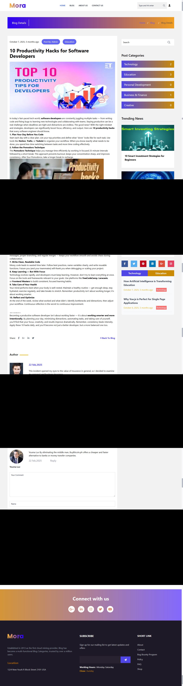

# Laravel Inertia Vue Blog Project

A full-stack blog application built with Laravel, Inertia.js, and Vue 3. The project includes a modern blog frontend and an authenticated admin panel for content management.

## Features

- Public blog pages: home, about, blog list, blog details, contact.
- Admin dashboard with authentication and email verification.
- CRUD modules for posts, categories, tags, and news.
- About section management from the backend.
- Rich-text editing support with CKEditor.
- Image handling with Intervention Image.
- SPA-like navigation powered by Inertia.js + Vue.

## Tech Stack

- Backend: Laravel 12, PHP 8.2+
- Frontend: Vue 3, Inertia.js, Vite, Tailwind CSS
- Auth: Laravel Jetstream + Sanctum + Fortify
- State/UI Utilities: Pinia, Axios, NProgress, Flowbite, Swiper, Vue Toastification
- Editor: CKEditor 5

## Requirements

- PHP 8.2 or higher
- Composer
- Node.js 18+ and npm
- MySQL, MariaDB, PostgreSQL, or SQLite

## Getting Started

1. Clone the repository.

```bash
git clone https://github.com/alsakib748/Laravel-Inertia-Vue-Blog.git
cd Laravel-Inertia-Vue-Blog
```

2. Install PHP dependencies.

```bash
composer install
```

3. Install JavaScript dependencies.

```bash
npm install
```

4. Create and configure your environment file.

```bash
cp .env.example .env # Linux/macOS
copy .env.example .env # Windows (cmd)
php artisan key:generate
```

5. Configure database credentials in `.env`, then run migrations and seeders.

```bash
php artisan migrate --seed
```

6. Link storage for uploaded files.

```bash
php artisan storage:link
```

7. Start the development environment.

```bash
composer run dev
```

This command runs the Laravel server, queue listener, logs, and Vite in parallel.

## Useful Commands

```bash
# Frontend development server only
npm run dev

# Production frontend build
npm run build

# Run automated tests
composer test

# Format PHP code
php ./vendor/bin/pint
```

## Project Structure

- `app/Http/Controllers/Frontend`: Public-facing page controllers.
- `app/Http/Controllers/Backend`: Admin resource controllers.
- `resources/js`: Inertia/Vue frontend code.
- `routes/frontend.php`: Public website routes.
- `routes/web.php`: Authenticated dashboard and backend routes.
- `database/migrations`: Database schema definitions.

## Screenshots

### Homepage


### Blog Listing



### Blog Details



## Testing

Run the test suite with:

```bash
composer test
```

## Deployment Notes

- Set `APP_ENV=production` and `APP_DEBUG=false`.
- Run `npm run build` before deployment.
- Cache configuration and routes:

```bash
php artisan config:cache
php artisan route:cache
php artisan view:cache
```

## Contributing

Contributions are welcome. Please open an issue first to discuss major changes.

## License

This project is open-sourced under the MIT License.
